# Cipi GUI

The optional web control panel for [Cipi](https://cipi.sh): manage one or many Cipi servers from the browser through the [Cipi REST API](https://github.com/cipi-sh/api) — apps, deploys, domains, routing, databases, PHP and Node runtimes, monitoring and API access.

<picture>
  <source media="(prefers-color-scheme: light)" srcset="docs/screenshots/dashboard-light.webp">
  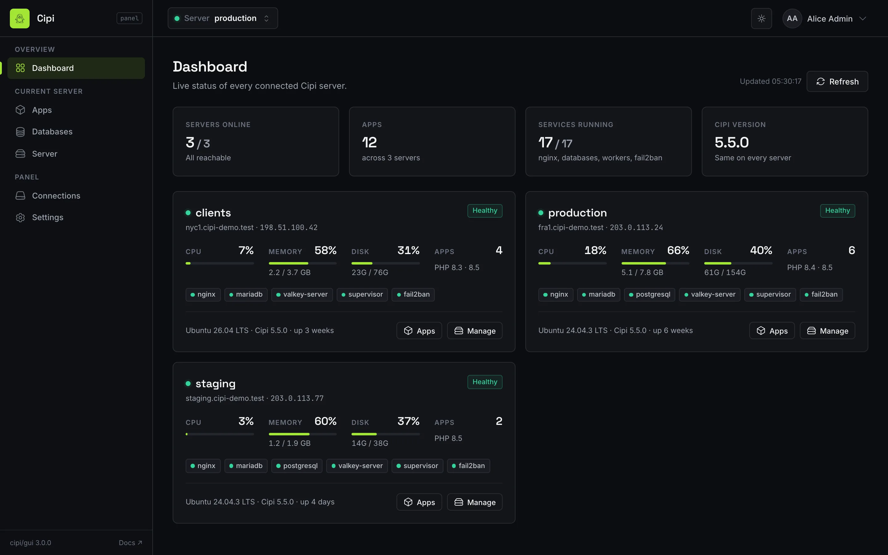
</picture>

Cipi stays CLI-first. The panel is a thin Laravel + Livewire client of the API: everything it does can still be done with `cipi` over SSH, it keeps no state about your servers besides an encrypted API token, and removing it leaves every server untouched.

> Screenshots in this README come from the bundled demo environment (`./dev/demo.sh`) — a stand-in for `cipi api` 1.33 with three fictional servers. See [Local development & demo](#local-development--demo).

## Requirements

- A Cipi server to host the panel — `cipi gui <domain>` provisions everything
- **Cipi API** on every server you manage (`cipi api`), ideally API **1.33+** with Cipi **5.5.2+** (disk usage); 1.31 / 5.4.1 for everything else
- PHP 8.3+, Laravel 12 or 13, Livewire 3.6+ or 4 (only relevant for manual installs)

## Installation

On a Cipi server:

```bash
cipi gui panel.example.com     # Laravel host app, FPM pool, vhost, scheduler, first admin
cipi gui ssl                   # Let's Encrypt for the panel
```

Updates: `cipi gui update` (Composer update + migrations + theme refresh) or `cipi gui upgrade` (clean rebuild). See the [GUI docs](https://cipi.sh/docs/gui) for every subcommand.

Manual install in an existing Laravel app:

```bash
composer require cipi/gui
php artisan vendor:publish --tag=cipi-gui-config
php artisan migrate
php artisan cipi:seed-gui-user --email=admin@example.com --password='a-long-passphrase'
```

## Connecting servers

1. Enable the API on the server: `cipi api`
2. Create a token with every ability the panel uses (the **Connections** page shows the same command with a copy button):

```bash
cipi api token create --name=gui --abilities=apps-view,apps-create,apps-edit,apps-delete,apps-suspend,apps-basicauth,apps-env,apps-auth,apps-artisan,apps-run,apps-deploy-config,aliases-view,aliases-create,aliases-delete,www-manage,redirects-view,redirects-manage,proxies-view,proxies-manage,node-view,node-manage,search-view,search-manage,deploy-manage,ssl-manage,dbs-view,dbs-create,dbs-manage,php-view,php-manage,ssh-view,ssh-manage,services-view,services-manage,smtp-view,smtp-manage,health-view,health-manage,packages-view,monitor-view,zt-view,disk-view,ip-whitelist-view,ip-whitelist-manage,status-view
```

3. In the panel open **Connections → Add server** and enter a name, the API URL (`https://vps.example.com`) and the token. The connection is tested right away; tokens are encrypted at rest with Laravel's `Crypt`.

Sections a server's API or token does not support are shown as "not available" one by one — an older server still works for everything else.

## What you can do

| | |
|---|---|
| 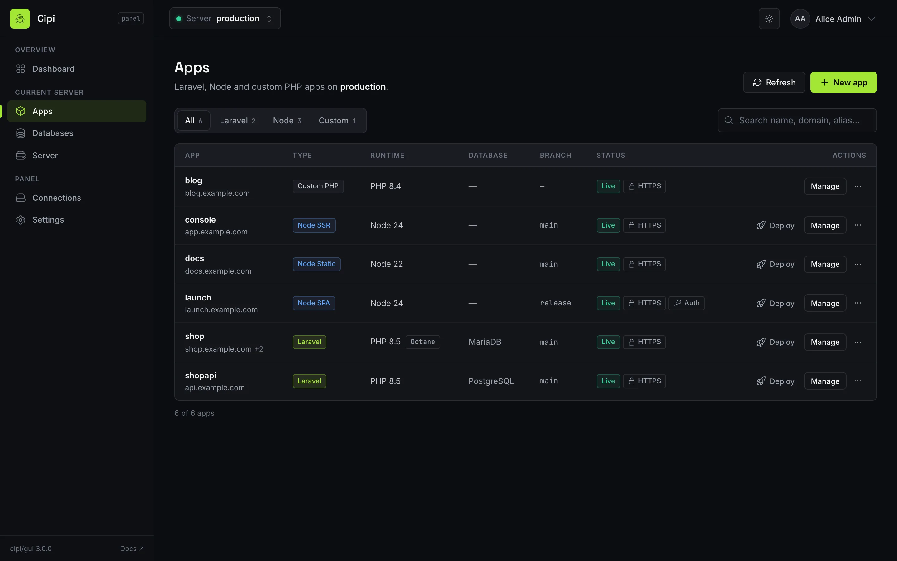 | **Apps** — Laravel (PHP-FPM or Octane/FrankenPHP), Node (SPA, static, SSR with Next, Nuxt, SvelteKit, Astro, Remix or Vite) and custom PHP apps on the current server. Filter by type, search by name, domain or alias, deploy from the list. |
| 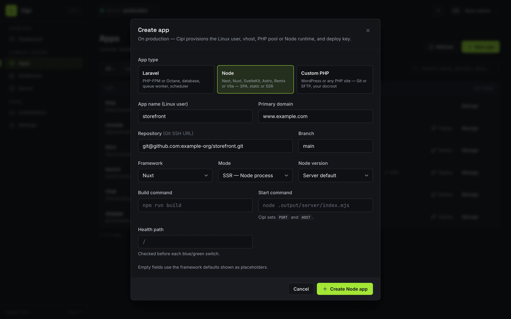 | **Create** apps with a type picker; Node framework presets use the same defaults as `cipi app create --node`. Wildcard primary domains (`*.example.com`) are accepted. |
| 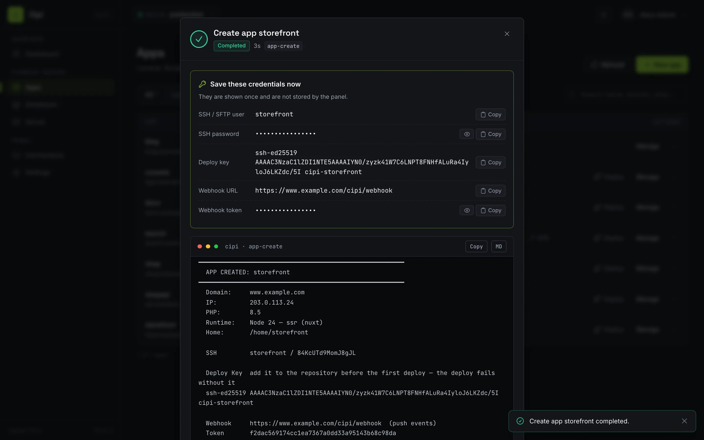 | **Async jobs** run in an overlay with live status, elapsed time and the CLI output. One-time secrets — SSH and database passwords, deploy key, webhook URL and token — are listed with copy buttons. |
| 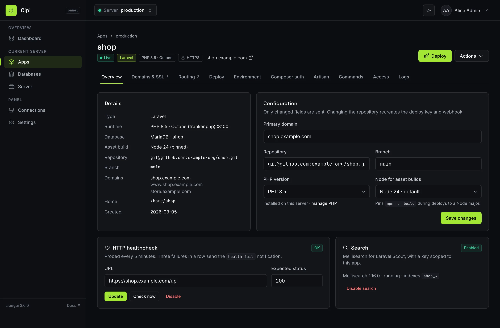 | **App overview** — details, configuration (PHP version, Node pin, repository, branch, domain), HTTP healthcheck and Meilisearch/Scout. Tabs are part of the URL, so every view can be bookmarked. |
| 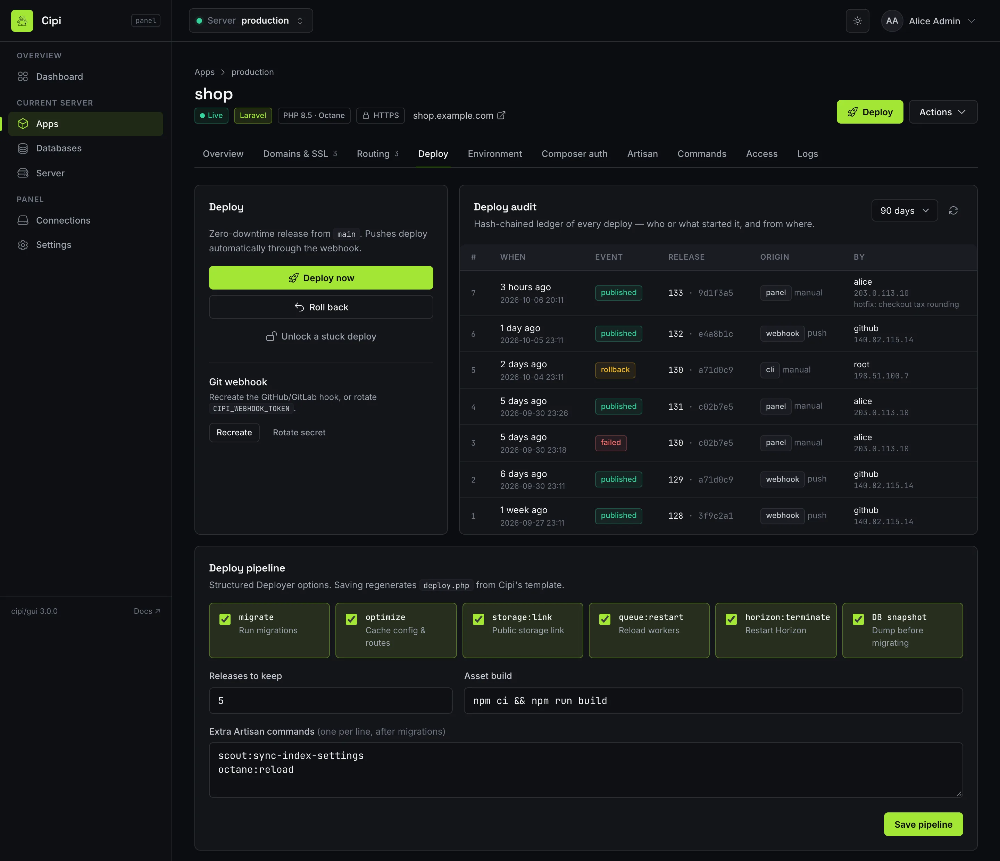 | **Deploy** — deploy, roll back, unlock, recreate or rotate the Git webhook, the hash-chained **deploy audit** (who, from where, which commit) and the structured `deploy.php` pipeline. |
| 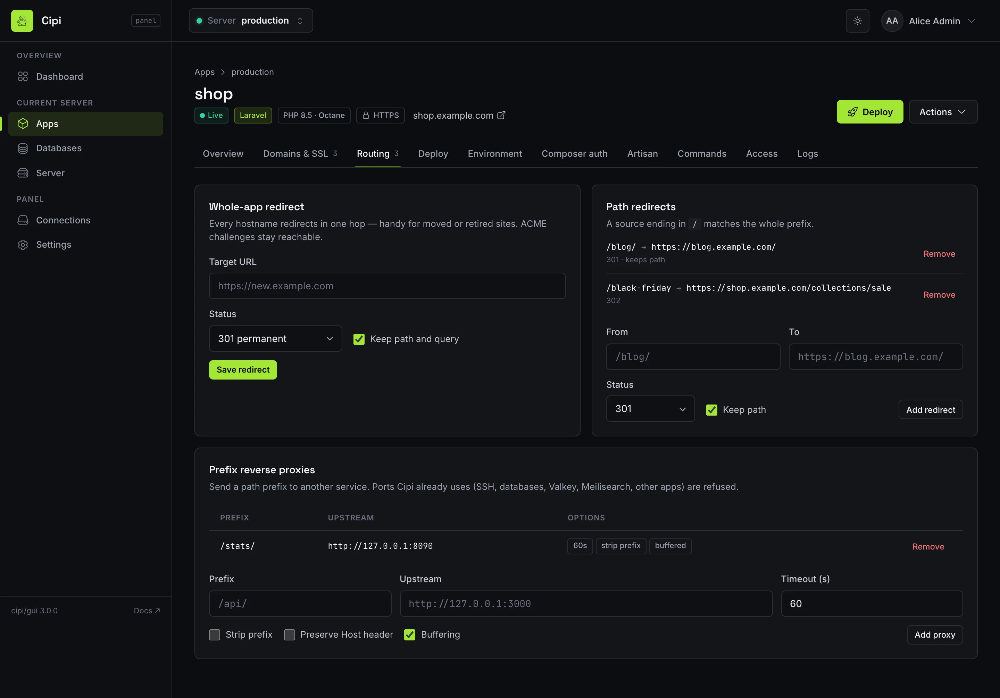 | **Routing** — whole-app redirect (set, toggle, remove), path redirects and prefix reverse proxies, with the same validation as `cipi redirect` / `cipi proxy`. |
| 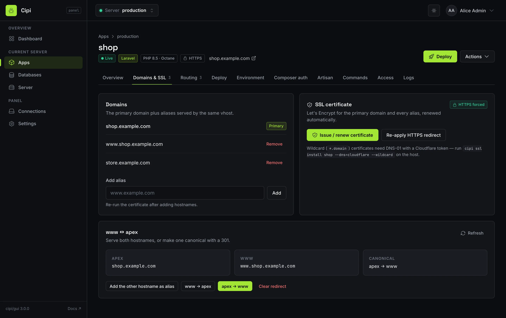 | **Domains & SSL** — aliases, Let's Encrypt, forced HTTPS and www ↔ apex canonical redirects. |
| 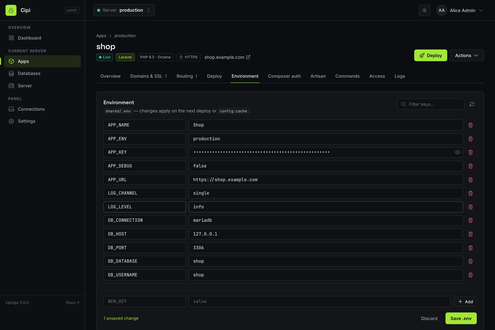 | **Environment** — edit `shared/.env` with sensitive values masked, a filter, and changed rows highlighted before saving. Also Composer `auth.json`, Artisan, whitelisted commands and HTTP basic auth. |
| 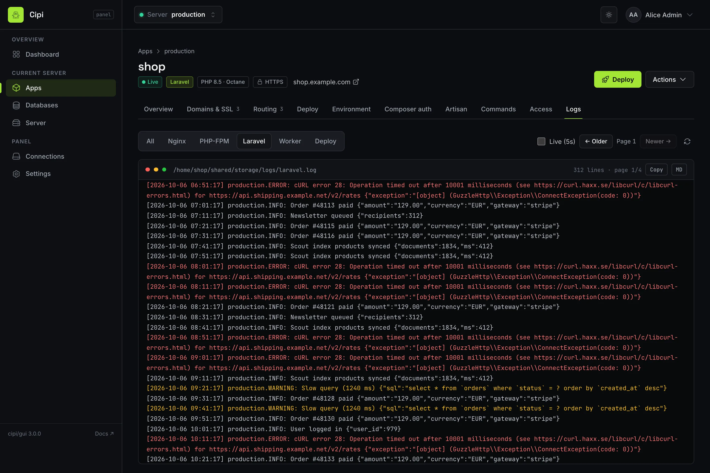 | **Logs** — nginx, PHP-FPM, Laravel, worker and deploy logs with pagination, live refresh and copy as Markdown. |
| 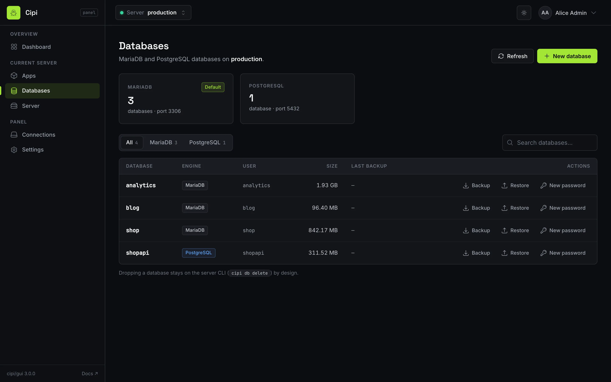 | **Databases** — MariaDB and PostgreSQL: create, back up, restore and rotate passwords (dropping stays on the CLI by design). |
| 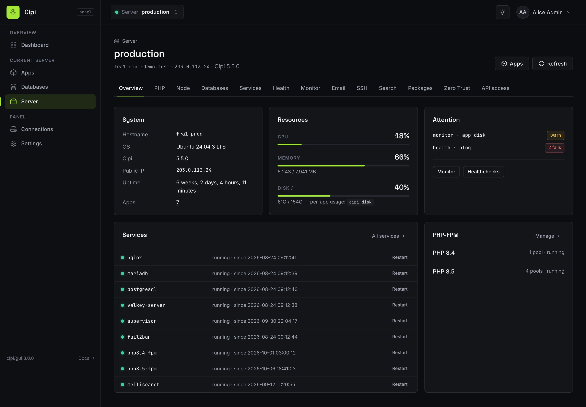 | **Server** — overview, **disk usage** (the filesystem, every app with files, database, total and soft limit, every database per engine), PHP versions, Node runtimes, database engines, services, healthchecks, monitor, email notifications, SSH keys, Meilisearch, optional packages, Cloudflare Zero Trust and the API IP whitelist. |
| 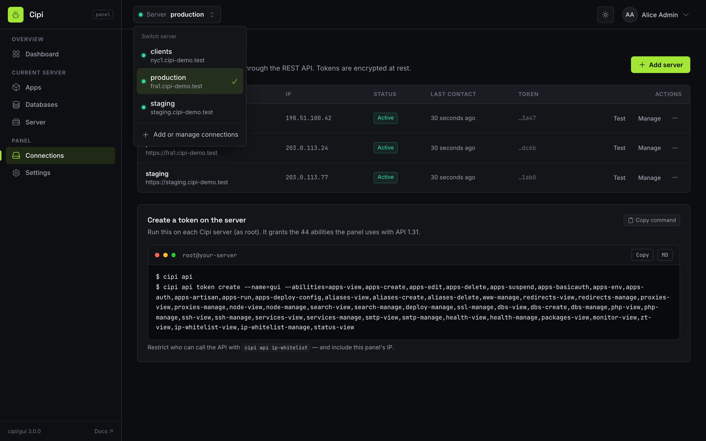 | **Connections & switcher** — add, edit, rotate tokens, disable or test servers; switch the current server from the header on any page. |
| 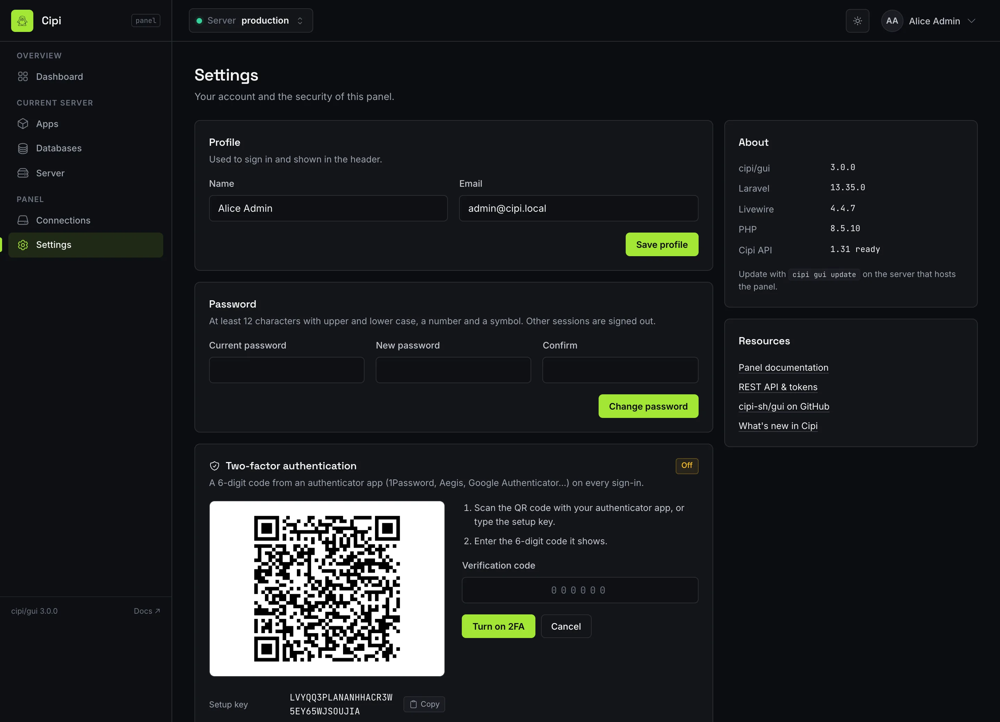 | **Settings** — profile, password (12+ characters, mixed case, number, symbol) and TOTP two-factor authentication. |

Light and dark themes follow the system preference (toggle in the header), and the layout adapts to phones:

<p>
  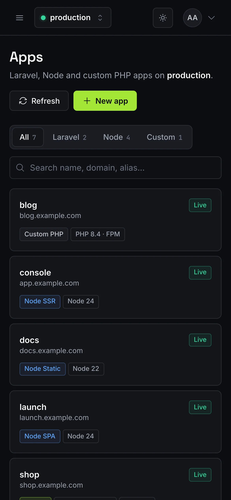
  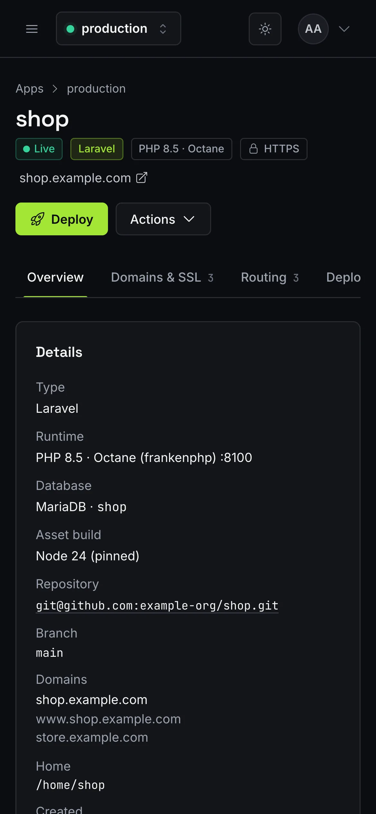
  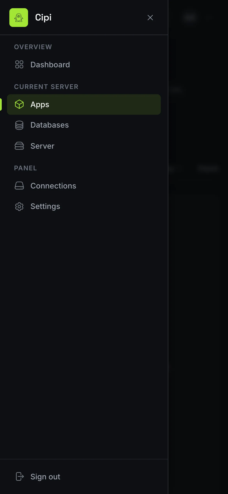
</p>

## API coverage

The panel targets **Cipi API 1.33** and degrades per section on older APIs or narrower tokens.

| Area | Endpoints |
|------|-----------|
| Status | `GET /api/status` — dashboard (queried concurrently for every server) and server overview |
| Apps | `GET/POST /api/apps`, `GET/PUT/DELETE /api/apps/{name}`, suspend, unsuspend, fix-permissions, webhook recreate; create accepts `engine`, `octane`, `custom`/`docroot` and Node (`node`, `framework`, `node_version`, `build`, `start`, `output`, `health_path`) |
| Env / auth.json | `GET/PUT /api/apps/{name}/env`, `GET/POST/PUT/DELETE /api/apps/{name}/auth` |
| Artisan / commands | `POST /api/apps/{name}/artisan`, `GET /api/run-commands`, `POST /api/apps/{name}/run` |
| Deploy | deploy, rollback, unlock, `GET /api/apps/{name}/deploy/audit`, `GET/PUT /api/apps/{name}/deploy-config` |
| Domains | aliases, `www` status/add/force-to-root/force-from-root/clear, `ssl`, `ssl/force` |
| Routing | `/redirects`, `/redirect` (set, enable, disable, unset), `/proxies` |
| Node | `GET /api/node`, `GET /api/apps/{name}/node`, `POST /api/apps/{name}/node/restart` |
| Search | `GET /api/search`, `POST /api/apps/{name}/search/enable` and `…/disable` |
| Health | `GET /api/health`, `GET/PUT/DELETE /api/apps/{name}/health`, `POST /api/apps/{name}/health/check` |
| Databases | `GET /api/dbs/engines`, `POST /api/dbs/engines/install`, `GET/POST /api/dbs`, backup, restore, password |
| Server | PHP list/install, SSH keys, services + restart, SMTP (configure, enable, disable, test, delete), packages, monitor, Zero Trust, IP whitelist |
| Disk | `GET /api/disk`, `GET /api/disk/dbs` — the figures of `cipi disk` / `cipi disk db` (API 1.33+, Cipi 5.5.2+ for the API sudoers); measured on request, so these two calls use `http_disk_timeout` |
| Logs | `GET /api/apps/{name}/logs` |
| Jobs | `GET /api/jobs/{id}` |

`cipi disk` is in the panel since API 1.33 (**Server → Disk**). What is not in the panel yet — per-app disk limits and Cloudflare DNS accounts (API 1.32), `cipi ssh apps` and `cipi firewall attempts` (CLI only) — is pointed to with the command where it matters.

## Configuration

`config/cipi-gui.php` (publish with `--tag=cipi-gui-config`):

| Key | Description | Default |
|-----|-------------|---------|
| `route_prefix` | URL prefix for every panel route | `''` |
| `job_poll_interval_ms` | How often a running job is polled | `1500` |
| `job_poll_max_attempts` | Poll attempts before giving up | `120` |
| `http_timeout` / `http_connect_timeout` | API request timeouts (seconds) | `30` / `10` |
| `http_disk_timeout` | Timeout for `GET /api/disk*`, which measure every app home on request (seconds) | `180` |
| `php_versions` | Fallback PHP hints when a server cannot list its versions | `['8.4', '8.5']` |
| `token_abilities` | Abilities shown in the token command on Connections | API 1.33 list |

Environment variables: `CIPI_GUI_PREFIX`, `CIPI_GUI_JOB_POLL_MS`, `CIPI_GUI_JOB_POLL_MAX`, `CIPI_GUI_HTTP_TIMEOUT`, `CIPI_GUI_HTTP_CONNECT_TIMEOUT`, `CIPI_GUI_HTTP_DISK_TIMEOUT`, `CIPI_GUI_ADMIN_EMAIL`, `CIPI_GUI_ADMIN_NAME`.

Artisan commands: `cipi:seed-gui-user` (create or `--reset` the admin), `cipi:gui-refresh-theme`, `cipi:gui-version`.

## Local development & demo

```bash
./dev/setup.sh      # Laravel host app in dev/host that loads this package from the working tree
./dev/demo.sh       # demo API + panel on http://127.0.0.1:8000 (admin@cipi.local / admin)
```

`dev/demo/api` is a stateful stand-in for `cipi api` 1.33: three fictional servers (production, client hosting, staging) with Laravel, Node and custom apps, databases, monitor checks, a deploy ledger and logs. Async jobs go from pending to completed with CLI-like output, and changes persist until `./dev/demo.sh --reset`. Domains and IPs are reserved documentation ranges. Details in [`dev/README.md`](dev/README.md).

Tests (Orchestra Testbench + PHPUnit) and the CI matrix (PHP 8.3–8.5 × Laravel 12/13 × Livewire 3/4):

```bash
composer install
composer test
```

## Architecture

```
cipi/gui
├── config/cipi-gui.php
├── database/migrations/        # cipi_servers, users 2FA columns
├── resources/
│   ├── css/cipi-gui.css         # theme, inlined — no build step
│   └── views/                   # layouts, partials, <x-cipi::…> components, Livewire views
├── routes/web.php
├── src/
│   ├── CipiGuiServiceProvider.php
│   ├── Livewire/                # Dashboard, Servers, Apps, AppDetail, Databases, ServerManage, Settings, LogViewer
│   ├── Services/                # CipiApiClient, JobOutputParser, TwoFactorService
│   └── Models/CipiServer.php
├── dev/                         # host bootstrap + demo API
└── tests/
```

How `cipi gui` provisions the panel on a server is described in [`docs/CIPI_CLI.md`](docs/CIPI_CLI.md). Release notes: [`CHANGELOG.md`](CHANGELOG.md).

## License

MIT
